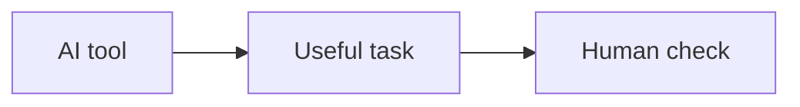

# AI Events

Date: September 17, 2026

AI tools are being used in schools, offices, and healthcare. They can save time, but they also need careful use.

Some people worry about fake news and privacy when AI creates content. Others see the benefits of faster research and better support.

- AI can help with writing and research
- Human review is still important
- Ethics and privacy must be considered

[Back to README](README.md)
